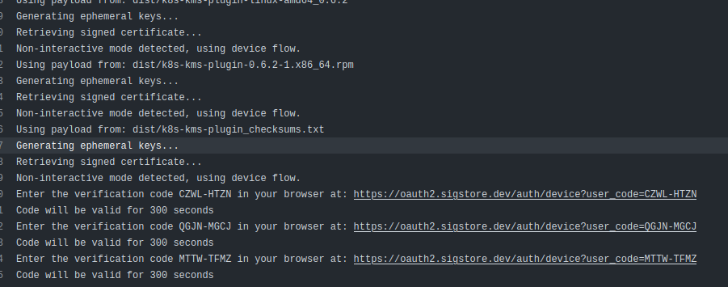
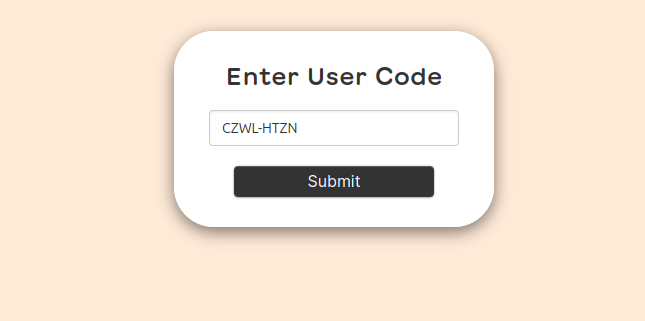

# K8S-KMS-Plugin

This microservice implements the Kubernetes KMS protocol as a gRPC service that leverages a remote or local HSM via PKCS11.

This plugin will also run in proxy mode which can connect to a remote plugin service running in a secure network device (Key Managers)

## requirements

This service is designed for kubernetes clusters that are using version 1.10.0 or higher and implements the KMS API:

https://kubernetes.io/docs/tasks/administer-cluster/kms-provider/

So for development purposes, you'll want a cluster that can be configured to use a KMS gRPC endpoint on your APIServer nodes.

To serve the k8s-kms-plugin for encryption operations from Kubernetes, you will need at least one AES key in a PKCS11 provider.

## KMS provider for SoftHsm V2

In this mode, we recommend to run the k8s-kms-plugin with the GCM algorithm.  
It provides a better design for authenticated encryption operations :

```sh
# debian
export MODULE="/usr/lib/softhsm/libsofthsm2.so"
# redhat
export MODULE="/usr/lib64/pkcs11/libsofthsm2.so"
# serve
k8s-kms-plugin serve \
  --provider p11 --p11-lib $MODULE --p11-key-label mykey --p11-label mylabel --p11-pin mypin --enable-server
```

## KMS provider for TPM2 PKCS11

You must know that AES GCM is not supported by the TPM v2 specifications.
In this mode, we recommend to run the k8s-kms-plugin with the CBC-then-HMAC algorithm. 
You must provide an HMAC key alongside the AES key for encryption :

```sh
# debian
export MODULE="/usr/lib/x86_64-linux-gnu/libtpm2_pkcs11.so.1"
# redhat
export MODULE="/usr/lib64/pkcs11/libtpm2_pkcs11.so"
# serve
k8s-kms-plugin serve \
  --provider p11 --p11-lib $MODULE --p11-key-label cbc0 --p11-hmac-label hmac0 --p11-label mylabel --p11-pin mypin --algorithm aes-cbc --enable-server
```

## Quick Start

Read the [QUICKSTART.md](QUICKSTART.md).

## Deployment scenarios

This plugin is designed to be deployed in 2 configurations

- Client/Server - k8s-kms-plugin in `client` mode will `enroll` to an external k8s-kms-plugin running in `serve` mode
- StandAlone(TODO) - Plugin and PKCS11 library deployed as StaticPod/HostContainer on APIServer nodes, this will require
coordination with k8s provisioning tools.

## Development Environment

`k8s` houses some sample client and server deployments for e2e testing until such time as this plugin is 100% network functional,
 and we can move it to a CICD pattern, as we'll have many actors to coordinate. 

All apis are defined in the `/apis` dir, and as we iterate on the spec docs, one must then run `make gen` and refactor 
until the 2 stacks come up

Both EST and KMS-Plugin binaries are in the `/cmd` dir
 
The `Makefile` contains commands for easy execution:
- `make gen` - generates all apis into gRPC or OpenAPI Servers and Clients
- `make dev` - loads project into your kubernetes cluster (minikube or GKE will work just fine), and continously builds and deploys as you develop.
- `make build` - builds the standalone `k8s-kms-plugin` binary

## Debug Environment

For a remote debug, build the plugin with debug mode :

```sh
go get github.com/go-delve/delve/cmd/dlv
make build-debug
```

It will generate a binary `k8s-kms-plugin` that can be used with Delve for debug purpose.  
Do not use this binary in a production environment.

## Vulnerability check

```sh
$ govulncheck ./...
Scanning your code and 288 packages across 34 dependent modules for known vulnerabilities...

No vulnerabilities found.
```

## Signing artifacts

During the release workflow, certificates and signatures of artifacts are generated.
They are signed by a tool named cosign using a keyless mode.
It required an authentication by clicking in links present in logs.



Once you click on one, you can submit a verification code that will redirect you to three types of authentication. Then click on Github authentication.

 

Do these actions for every authentication links and the signatures and the certificates will be generated with the artifacts in the release.

## Verifying the authenticity of an artifact

You need to downloads 3 files : [ _**[file.txt]**_, _**[file].pem**_, _**[file].sig**_]

If you don't have, install cosign by typing the commands below :

  ```bash
  curl -O -L "https://github.com/sigstore/cosign/releases/latest/download/cosign-linux-amd64"
  sudo mv cosign-linux-amd64 /usr/local/bin/cosign
  sudo chmod +x /usr/local/bin/cosign
  ```

For a verification with cosign installed and pay attention to modify the name of the files :

  ```bash
  COSIGN_EXPERIMENTAL=1 cosign verify-blob --cert [file]-keyless.pem --signature [file]-keyless.sig --certificate-oidc-issuer "https://github.com/login/oauth" --certificate-identity [ Mail adress of the owner of the repo ] [file]
  ```

Or using Podman without installing cosign :

```bash
podman run --rm -it gcr.io/projectsigstore/cosign:v1.13.0 COSIGN_EXPERIMENTAL=1 cosign verify-blob --cert [file]-keyless.pem --signature [file]-keyless.sig --certificate-oidc-issuer "https://github.com/login/oauth" --certificate-identity [ Mail adress of the owner of the repo ] [file]
```

## Verifying the SLSA attestation of a container

The image's attestation of provenance has been issued by a specific oidc-issuer that is 'https://token.actions.githubusercontent.com' in this repository.
In the next command example, it is required to replace digest by the digest of the image that needs to be verified and the owner of the repo.

```bash
cosign verify-attestation --type slsaprovenance \
      --certificate-identity-regexp="https://github.com/slsa-framework/slsa-github-generator/.github/workflows/generator_container_slsa3.yml@refs/tags/*" \
      --certificate-oidc-issuer="https://token.actions.githubusercontent.com" \
      ghcr.io/OWNER/k8s-kms-plugin@digest | jq .payload -r | base64 --decode | jq

```
