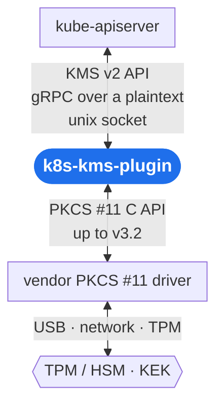


  Part of Eclipse KeySealer
  


  Relying on Eclipse KeyPont
  


<!-- The hero text and the "where it fits" diagram sit side by side on wide screens and stack on
     narrow ones; the layout rules are in website/assets/css/custom.css. The same diagram is in the
     main README.md, so change both together. -->


  Encrypt Kubernetes secrets&nbsp; with a TPM or HSM



  A gRPC service implementing the Kubernetes KMS v2 API,&nbsp; backed by a PKCS #11 device — including post-quantum ML-KEM.





  
  
  
  
  
  

